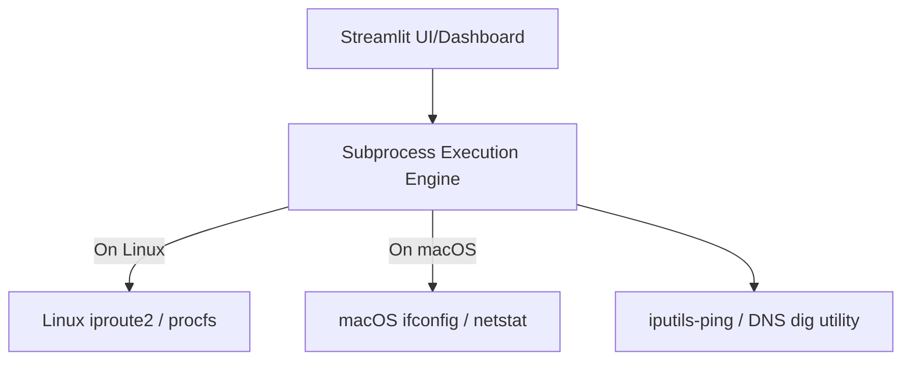

# Diagnostics & Application Architecture

This document describes the inner workings of `homelab-netstats`, how it retrieves system network stats, and the containerization requirements.

---

## 🏗️ Architecture Overview

The app is built as a single-page Streamlit dashboard (`streamlit_app.py`). It communicates with the host operating system's networking stack by spawning subprocess commands. It handles system-level differences dynamically, supporting both **Linux** (production VM/container environment) and **Darwin/macOS** (development machine).



---

## 🛠️ Diagnostics Implementation

### 1. System Config Retrieval

The system diagnostic components are fetched on load:
- **Interfaces**:
  - **Linux**: Runs `ip -br addr show` to get a clean brief list of interfaces, their link statuses (`UP`/`DOWN`), and associated IPs.
  - **macOS**: Runs `ifconfig` and parses `inet` entries mapped to their respective interface headers.
- **Default Gateway**:
  - **Linux**: Extracts the gateway IP from `ip route` (matching `default via`).
  - **macOS**: Extracts the gateway IP from `netstat -rn` (matching `default`).
- **System DNS Resolvers**:
  - Parses `/etc/resolv.conf` to extract lines starting with `nameserver`. It also displays the raw file output directly inside the dashboard UI for transparent verification of DNS search domains.

### 2. Ping Diagnostics

When the ping telemetry button is clicked:
- Runs `ping -c 3 -W 2 <IP>` to transmit 3 packets with a 2-second timeout.
- The output is parsed using regular expressions:
  - **Packet Loss**: Matches `(\d+)% packet loss`.
  - **Latency**: Extracts the average round-trip time (`rtt` or `round-trip`) from the timing summary block (format: `min/avg/max/mdev`).
- Status is classified as:
  - `✅ HEALTHY`: `0%` packet loss.
  - `⚠️ LOSS`: `< 100%` packet loss.
  - `❌ DOWN`: `100%` packet loss (or complete timeout).

### 3. DNS Lookup Timing

To verify DNS reliability and search-domain resolution:
- Spawns `dig +short +tries=1 +timeout=2 <hostname>` optionally appending `@<dns-server>` to test specific resolvers.
- Measures the execution elapsed time via Python's `time.time()` to calculate lookup latency in milliseconds.
- Tests multiple targets to differentiate local resolution performance (such as resolving local app subdomains on `mapleleafhome.net` via AdGuard) from external lookups (such as `google.com`).

---

## 📦 Containerization Design

Streamlit runs inside a minimal Docker image. Because standard slim Python images do not bundle networking binaries, the `Dockerfile` explicitly installs these utilities:

```dockerfile
RUN apt-get update && apt-get install -y --no-install-recommends \
    iputils-ping \
    dnsutils \
    curl \
    && rm -rf /var/lib/apt/lists/*
```

### Key Considerations
1. **Tooling Requirements**: If `iputils-ping` or `dnsutils` (`dig`) is missing, the application UI will capture the execution failure and gracefully report error logs instead of crashing the dashboard.
2. **Ports**: Streamlit's default port `8501` is exposed and mapped directly via Docker Compose.
3. **Execution Context**: The container runs safely as a standard user without requiring privileged mode (`root` capability), making it clean to deploy in homelab virtualization setups.
